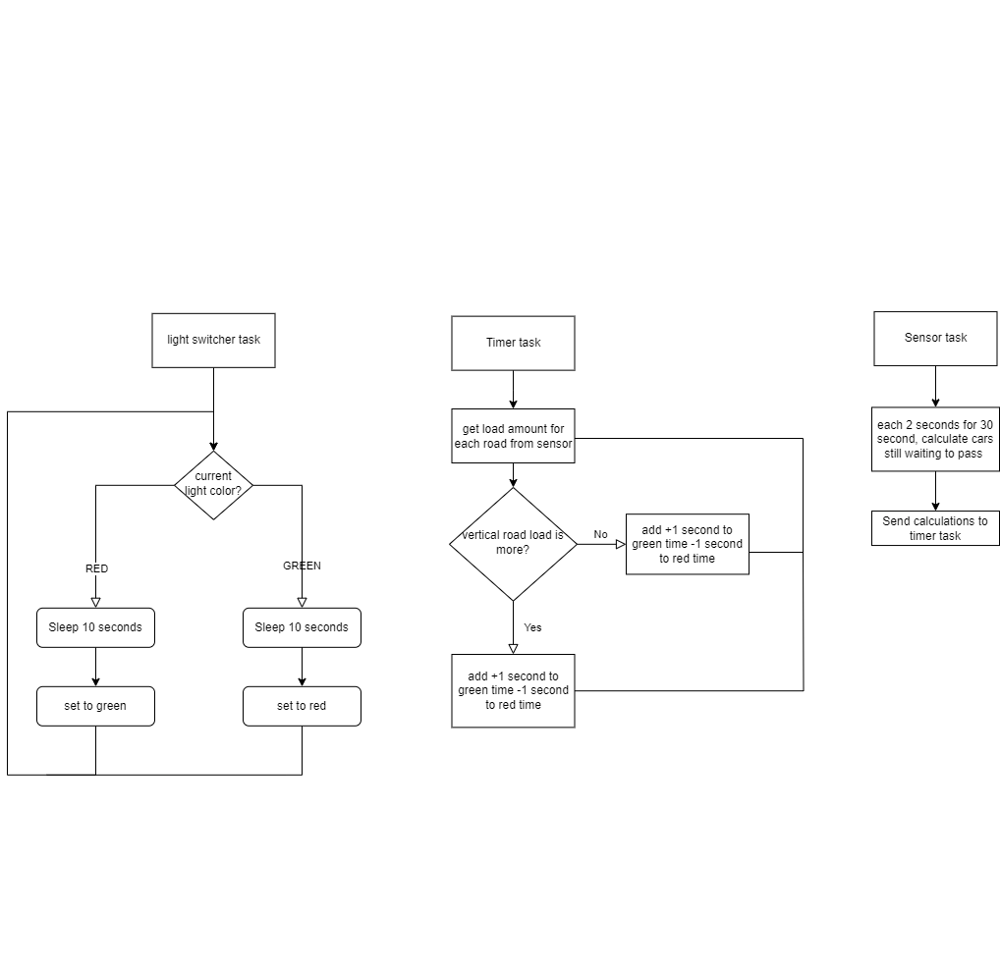

# Real-time Traffic Control Simulation


## Requirements
ncursesw (wide character support)
```
export LIB_PATH=~/.local
cd ~
wget https://invisible-island.net/datafiles/release/ncurses.tar.gz
tar xzf ncurses.tar.gz
cd $(find . -iname 'ncurses*' -type d | head -n 1)
./configure --enable-widec --enable-ext-colors --with-default-terminfo=xterm-256color --with-ncursesw --with-shared  --with-cxx-shared --prefix=$LIB_PATH
make && make install
```
## Running
```
make
```

## Flowchart

## Introduction:
The purpose of this project is to create a real-time traffic control simulation using FreeRTOS in C programming language. The simulation will include 4 traffic lights that control the flow of cars in a + intersection type. The intersection will consist of two lanes for each road, and each lane will have a traffic light. The simulation will allow cars to move forward only if no other car is in front of it, and it will stop due to light control. Cars inside the intersection can only pass if the light is green or yellow. ~~Red/green lights can only be switched on/off if no car is in the intersection~~ (yellow light was added to let them move before any red/green switch happens, to prevent traffic accidents).  

The goal of this project is to make the lights change their timer dynamically according to the amount of traffic in the lanes, by default light timers are red(10s) green(8s) yellow(2s).

## Requirements:

- The simulation should have 4 traffic lights, with red, green and yellow colors.
- The traffic lights should be put in a + intersection type, each road has 2 lanes (opposite of each other) and each lane has 1 traffic light (4 in total).
- Cars can only move forward (if no other car is in front of it) and can stop (due to light control).
- Cars inside the intersection can only pass if the light is green or yellow.
- Red/green lights can only be switched on/off if no car is in the intersection.
- Yellow light was added to let them move before any red/green switch happens, to prevent traffic accidents.
- The light timers should be changed dynamically according to the amount of traffic in the lanes.
- The road state (number of cars) should be read by 4 FreeRTOS tasks, and they are responsible for changing the timer for the lights according to the traffic jam in each road.
- The road with more traffic will gain more green time, while the road with less traffic will gain less green time.
- The tasks should not completely ignore a 1 car waiting in a less traffic road.
- The simulation should have a visualization using ncurses library, which displays the state of the road, lights, and traffic.

## Assumptions:

- The simulation will run on a Linux-based operating system.
- The system will have sufficient memory to store the road state and control the traffic lights.
- The system will have enough processing power to perform real-time traffic control.
## Constraints:

- The simulation should be built using FreeRTOS in C programming language.
- The ncurses library will be used for visualization.
- The simulation should be completed within the given time frame.

## Implementation Criticism:

- It is recommended to include error handling in the code to handle unexpected inputs or situations.
- The code should be well documented and follow a consistent coding style to improve readability and maintainability.
- It is important to ensure that the simulation is realistic and reflects the real-world traffic situations.
- It is recommended to perform unit tests and integration tests to ensure that the simulation is working as expected.
- The code should be optimized to minimize the processing time and memory usage.
- The simulation should be scalable to accommodate future enhancements or modifications.
